<div align="center">



<br>

<a href="https://github.com/vbahadorzadeh?tab=repositories"></a>


<br><br>


</div>


## `$ whoami`

Most of my week happens somewhere between a soldering iron and a packet capture.

I like problems where the answer isn't in the docs, hardware that ships with a datasheet in a language nobody speaks, and the specific joy of watching a $4 microcontroller do something it was absolutely not designed for.

```c
struct vahid {
    char *domains[]  = { "embedded", "edge-ai", "android", "networking" };
    char *fuel       = "caffeine + spite";
    bool  reads_datasheets_for_fun = true;   // allegedly
    int   dev_boards_owned;                  // overflowed
};
```


## `$ ls ~/projects`

<table>
<tr>
<td width="50%" valign="top">

### 🛰️ LocAIgent
A local-first AI agent platform. Because sending my filesystem to someone else's GPU felt like a choice — and I chose otherwise.

`python` · `llm` · `self-hosted`

</td>
<td width="50%" valign="top">

### 📡 P2P Messenger
Messaging that keeps working when the internet stops. Built for the days the pipes get squeezed.

`p2p` · `mesh` · `crypto`

</td>
</tr>
<tr>
<td width="50%" valign="top">

### 🍓 PiGate
A Raspberry Pi that boots into a 7" dashboard and quietly becomes your router, ad-blocker, and escape hatch.

`raspberry-pi` · `networking` · `dns`

</td>
<td width="50%" valign="top">

### ⚡ ESP32 Power Meter
Tells me exactly how much electricity my other projects waste. The results were humbling.

`esp32` · `pzem-004t` · `iot`

</td>
</tr>
<tr>
<td width="50%" valign="top">

### 🚢 Freighter
A macOS download manager that isn't shareware from 2011. Torrents included, nag screens not.

`swift` · `libtorrent` · `macos`

</td>
<td width="50%" valign="top">

### 🔧 …and a drawer of others
Half-finished boards, forks with strong opinions, and scripts that only run on my machine.

`wontfix` · `works-for-me`

</td>
</tr>
</table>

> *Some of these are finished. Some are aggressively in progress. I'll let you guess which.*


## `$ cat toolbox.txt`

<div align="center">


</div>


## `$ uptime`

<div align="center">


<br>


</div>


## `$ ./snake --eat-contributions`

<div align="center">

<picture>
  <source media="(prefers-color-scheme: dark)" srcset="https://raw.githubusercontent.com/vbahadorzadeh/vbahadorzadeh/output/snake-dark.svg">
  <source media="(prefers-color-scheme: light)" srcset="https://raw.githubusercontent.com/vbahadorzadeh/vbahadorzadeh/output/snake.svg">
  
</picture>

<sub><i>the only process on this profile with a guaranteed exit condition</i></sub>

</div>


## `$ tail -f now.log`

```log
[warn]  bought another dev board "for a specific project"
[info]  project undefined. board acquired regardless.
[debug] mesh network stable for 41 days. cause unknown. do not investigate.
[error] estimated 2 hours. actual 2 weeks. closing as expected behavior.
[info]  currently poking at: local-first AI + networks that don't ask permission
```


<div align="center">

### Got a stubborn device, a weird protocol, or a network that won't cooperate?

**I'm interested.**

<br>

<a href="mailto:v.bahadorzadeh@gmail.com"></a>
<a href="https://linkedin.com/in/vbahadorzadeh"></a>
<a href="https://t.me/vbahadorzadeh"></a>

<br><br>

<sub><i>This README is open source. So is most of my judgment.</i></sub>


</div>
